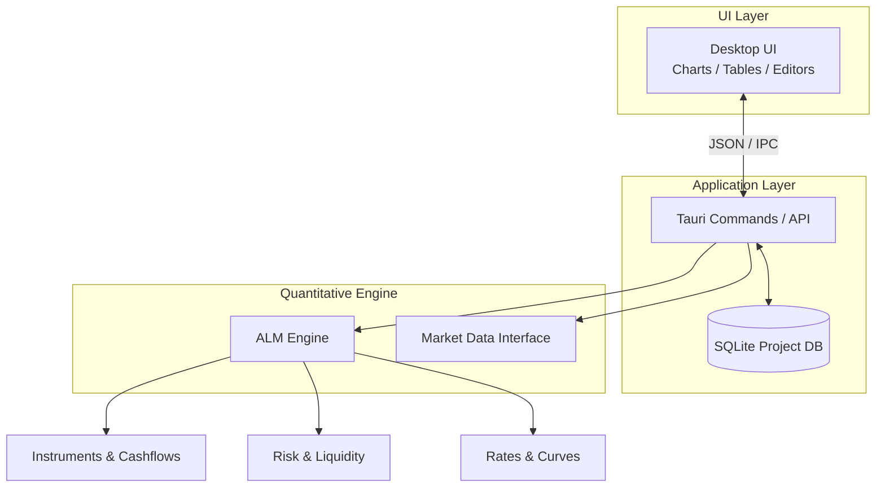
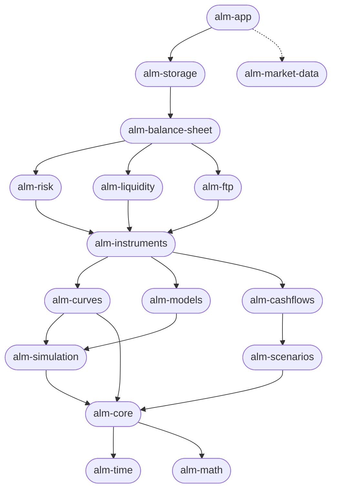

# ALM Workstation

A standalone, desktop quantitative-finance application for Asset-Liability and Liquidity Management (ALM). 

The application is built with a highly decoupled **Rust** quantitative calculation engine and a modern **React + Tauri** web frontend for the user interface. It provides a local, self-contained workspace for analyzing balance sheets, performing scenario stress testing, calculating EVE and NII, and assessing liquidity risks.

## High-Level Architecture

The quantitative engine is completely independent of the UI, providing a serious computational core that can also be run headlessly or as a server.



## Workspace Structure

The project is structured as a Cargo workspace with strict dependency directions. 



### Crate Hierarchy

#### App & Integration Layer
* **`alm-app`**: The Tauri + React/Vite shell. Knows nothing about financial mathematics.
* **`alm-storage`**: SQLite database integration for managing workspaces, portfolios, and scenarios locally.
* **`alm-market-data`**: Parsing and ingestion of CSV/JSON files, and yielding market data curves.

#### Balance Sheet & Analysis Layer
* **`alm-balance-sheet`**: Defines asset/liability portfolios, product segments, and runoff strategies.
* **`alm-risk`**: Calculations for EVE, NII, VaR, duration, convexity, and sensitivity.
* **`alm-liquidity`**: Cashflow gaps, funding concentration, stress testing, LCR, and NSFR.
* **`alm-ftp`**: Funds Transfer Pricing rules and behavioral models.

#### Products & Modeling Layer
* **`alm-instruments`**: First-class objects for Bonds, Swaps, Options, Mortgages, and Non-maturing deposits.
* **`alm-cashflows`**: Cashflow schedules, amortization, prepayments, and defaults.
* **`alm-curves`**: Yield curves, zero curves, forward curves, bootstrapping, and interpolations.
* **`alm-models`**: Stochastic models (Vasicek, Hull-White, Black-Scholes, GARCH).
* **`alm-scenarios`**: Interest rate and FX shocks, along with Monte Carlo scenarios.
* **`alm-simulation`**: The Monte Carlo execution engine and convergence statistics.

#### Core Foundations
* **`alm-core`**: Core domain primitives (Money, Currency, Rates).
* **`alm-time`**: Calendars, business days, and day-count conventions.
* **`alm-math`**: Statistics, linear algebra, and optimizations.

## Getting Started

Make sure you have [Rust](https://www.rust-lang.org/), [Node.js](https://nodejs.org/), and Tauri prerequisites installed.

```bash
# Check the Rust workspace compiles
cargo check

# Navigate into the app to run the desktop client
cd crates/alm-app
npm install
npm run tauri dev
```
